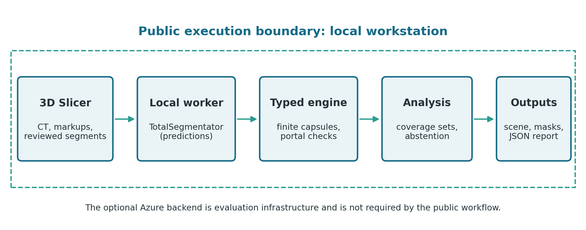
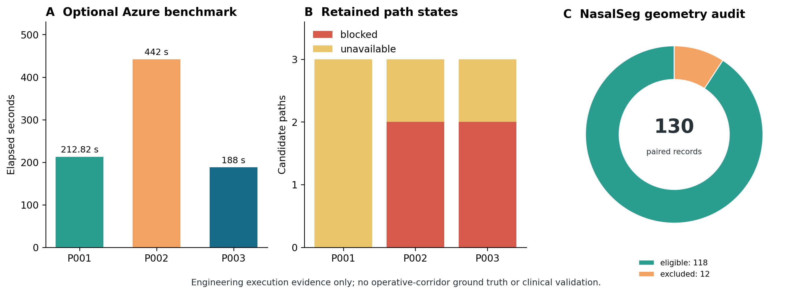

# skullbase-corridor: Local-first research software for inspectable finite-instrument skull-base corridor geometry

## Article metadata

- **Article type:** SoftwareX software article
- **Author:** Abhinav Bachu
- **Affiliation:** **HUMAN METADATA REQUIRED — verify department, institution, city, and country**
- **Corresponding author:** Abhinav Bachu
- **Corresponding-author email:** **HUMAN METADATA REQUIRED**
- **ORCID:** **HUMAN METADATA REQUIRED — do not infer**
- **Submission date:** **HUMAN METADATA REQUIRED**
- **Software release cited by this article:** version 0.2.1 in the inspected checkout
- **Repository URL and immutable release tag/commit:** **HUMAN METADATA REQUIRED**
- **Archived software identifier/DOI:** [10.5281/zenodo.23244307](https://doi.org/10.5281/zenodo.23244307)
- **Archived evidence-supplement identifier:** **HUMAN METADATA REQUIRED**

## Abstract

`skullbase-corridor` is open research software for reproducible, surgeon-supervised exploration of rigid skull-base approach corridors in physical image coordinates. It represents target samples, protected structures, finite circular portals, and finite rigid instruments, then records evaluated trajectories, reached target indices, insertion depths, clearances, coverage set operations, and explicit rejection or abstention reasons. The package combines a typed Python geometry engine, command-line and desktop interfaces, and a 3D Slicer module for image, segmentation, markup, linked-slice, three-dimensional, and report workflows. Its public-runtime policy is local-first: the intended distributed workflow keeps input images and generated artifacts on the user's workstation and has Slicer launch a managed local TotalSegmentator worker using CPU or, where configured and supported, GPU execution. A remote Azure D4 CPU deployment is retained only as an optional engineering evaluation benchmark, not as the public runtime or a required service. Verification materials include deterministic analytical fixtures, independent geometric references, synthetic desktop workflows, Slicer integration checks, and computational execution on a public dataset. The retained NasalSeg v2 audit accounts for 130 image/label pairs, of which 118 met recorded engineering-geometry criteria and 12 were excluded for physical-geometry mismatch. These data contain air-space labels rather than operative-corridor reference annotations. This article is a software publication only: it makes no claim of clinical safety, efficacy, superiority, usability, validation, patient benefit, or regulatory suitability.

## Keywords

research software; computational geometry; medical imaging; 3D Slicer; finite instruments; skull base; reproducibility; local-first computing

## Code metadata

- **Current code version:** 0.2.1
- **Permanent link to code/repository used for this article:** **HUMAN METADATA REQUIRED**
- **Permanent link to reproducible capsule/evidence supplement:** **HUMAN METADATA REQUIRED**
- **Legal code license:** Apache License 2.0
- **Code language:** Python (Python 3.11 or newer); scripted 3D Slicer module
- **Build system:** Hatchling
- **Supported operating systems:** The Python package is designed to be cross-platform; **HUMAN METADATA REQUIRED — report only operating systems verified for the archived release**
- **Installation:** Python package from the fixed source release; packaged 3D Slicer 5.12 extension workflow
- **Primary dependencies:** NumPy, SciPy, nibabel, SimpleITK, pydicom, Pydantic, and Typer; optional PySide6, pyqtgraph, and VTK for the standalone desktop interface
- **Issue tracker:** **HUMAN METADATA REQUIRED**
- **Developer documentation:** repository `README.md`, `docs/`, `slicer/README.md`, and packaging verification scripts in the fixed release
- **Data included with the software:** deterministic synthetic fixtures only; public CT archives, user sessions, screenshots, model weights, and private data are not included
- **Reuse potential:** physical-space finite-instrument reach analysis, explicit incomplete-anatomy handling, approach coverage comparison, and traceable image-linked research workflows

## 1. Motivation and significance

Computational descriptions of a surgical corridor can obscure distinctions that materially change a geometric result. An infinitely thin ray is not a finite-width instrument; an instrument has finite length; an oblique instrument must fit through an aperture; an alternative route is not necessarily available simultaneously with another route; and an unrepresented structure is not demonstrated free space. A sampled failure to reach a target is also not proof of physical or operative inaccessibility.

`skullbase-corridor` was developed to make these assumptions explicit and inspectable. The intended users are technically supported surgeons and researchers studying configured geometric scenarios. Portal locations, target samples, protected structures, registration, segmentations, instrument dimensions, and review state remain inputs requiring human review. The software does not convert these inputs into clinical ground truth.

The contribution is a reusable software representation of finite-instrument corridor geometry with traceable witnesses and conservative handling of incomplete information. Existing medical-image visualization and annotation functions are used through 3D Slicer [@slicer]. The package adds typed corridor semantics, finite insertion and aperture constraints, exact-path state reporting, approach-specific set comparisons, incomplete-anatomy abstention, and checksummed exports. It supports reproducible software experiments without asserting that the configured openings are anatomically appropriate or that a geometrically feasible path is surgically safe.

## 2. Software architecture and functionality

### 2.1 Components and data flow

The `src/skullbase_corridor` Python package separates domain models, image input/output, geometry primitives and engines, analysis, application services, desktop views, anatomy adapters, and exports. Typed Pydantic contracts define cases and results. The command-line interface supports synthetic-case generation, analysis, and environment reporting. The optional Qt/VTK desktop application provides linked anatomical slices, three-dimensional inspection, editable configuration, asynchronous analysis, and export.

The scripted Slicer module integrates CT selection, markups, segmentation review, candidate display, exact evaluated paths, linked two- and three-dimensional views, scene persistence, and report export. A separate bounded bridge can export selected Slicer segments on the full CT grid, convert Slicer's array order to engine order, retain the world-RAS affine, and import a saved coverage segmentation. Targets above the bridge's 2,000-foreground-voxel limit are rejected rather than silently subsampled.

The publication runtime is local-first by policy: input imaging, model outputs, intermediate masks, analysis results, and review artifacts are intended to remain on the local workstation. Slicer is intended to launch a package-managed local TotalSegmentator [@totalsegmentator] process for CPU inference or for GPU inference when a compatible local accelerator and software stack are configured. No cloud service is required by the publication design. Model predictions are labeled as predictions and require review.

The source also contains an asynchronous HTTPS provider, cache, and CPU worker
implementation originally exercised on Azure. Those modules are optional
evaluation infrastructure and are not the default public workflow. The Slicer
controller defaults to the managed local worker; selecting the optional Azure
backend is an explicit advanced configuration requiring a separate endpoint and
token. This distinction preserves the local-data policy for ordinary use.

<div class="figure">

<p class="caption"><strong>Figure 1.</strong> Local-first software architecture and data flow. The public workflow keeps CT images, predictions, geometry, and reports on the user's workstation. The optional Azure backend is retained only as evaluation infrastructure.</p>
</div>

### 2.2 Coordinates and input representations

All engine geometry is represented in millimetres in a declared physical frame. Affine matrices map voxel indices to physical positions. Image loaders normalize declared RAS/LPS conventions and spatial units to RAS millimetres, and incompatible frames are rejected rather than silently aligned. Registration and resampling are explicit review operations.

Targets can be supplied as physical-coordinate points or mask-derived voxel centres. Complete voxel representations may carry physical cell weights computed from the affine determinant. Sparse samples support count-based coverage only and are not interpreted as tumour-volume percentages. Protected geometry can be represented by analytical spheres or affine voxel masks. Unsupported geometry, including the current unsupported mesh input route, causes abstention rather than being treated as empty space.

### 2.3 Finite-instrument reach and aperture model

For entry point \(\mathbf{e}\), unit direction \(\mathbf{d}\), and target sample \(\mathbf{x}\), required axial insertion is

\[
t=(\mathbf{x}-\mathbf{e})\cdot\mathbf{d},
\]

and perpendicular distance from the trajectory is

\[
\left\|(\mathbf{x}-\mathbf{e})-t\mathbf{d}\right\|.
\]

A target sample is a reach candidate only when insertion is nonnegative, does not exceed instrument length, and the perpendicular distance is no greater than the working-tip radius plus configured target tolerance. Shaft radius is not added to target tolerance.

The inserted instrument is modeled as a finite capsule from the entry point to the insertion depth required for the target. Collision and aperture checks conservatively use the larger of shaft radius and working-tip radius. A portal is a finite circular disk with a declared forward normal. The software checks forward traversal and conservatively tests whether the oblique shaft footprint fits the aperture. This is not a manufacturer-specific, articulated, deformable, or tissue-interacting instrument model.

<div class="figure">

<p class="caption"><strong>Figure 2.</strong> Synthetic finite-instrument geometry schematic. (A) A finite swept capsule traverses a finite portal toward a target sample. (B) Exact-path evaluation retains collision states against represented protected geometry. This schematic is not patient anatomy and is not to scale.</p>
</div>

Analytical sphere clearance is computed directly. Voxel masks represent closed affine cells. The coarse voxel backend uses conservative physical-space bounds and interpolation guards; optional near-boundary refinement checks candidate cells under a finite budget. Exhausting that budget preserves conservative blockage. Geometry required outside a protected mask field of view triggers the configured out-of-field policy.

### 2.4 Abstention, sampling, and comparison semantics

Missing, unknown, unsupported, or out-of-field protected anatomy can produce abstention. An explicit exploratory policy may permit a conditional result, but affected quantitative claims remain incomplete or suppressed. These policies do not detect every missing structure, segmentation error, incorrect portal, or unmodeled tissue.

The engine evaluates a configured angular grid and may add target-directed and budgeted adaptive directions. This search is finite and not exhaustive. Each evaluated trajectory retains its direction, target indices, insertion depths, clearance information, and rejection or abstention reason. Consequently, “not reached” means that no evaluated path reached the sample; it does not mean that no path exists.

Reached target-index sets are retained separately by approach. Union, intersection, and incremental coverage are computed as set operations to avoid double counting. Simultaneous-access analysis additionally enforces angular separation and finite capsule-to-capsule clearance. Alternative-path union coverage is not interpreted as simultaneous feasibility.

Supported unobstructed centre-entry cases use geometry-aware interval-union integration for feasible solid angle. Protected-structure cases use spherical-cap grid quadrature with Voronoi area weights; added target-directed and adaptive witnesses receive no quadrature weight. Unsupported or nonconverged measurements are omitted. The software makes no general one-percent angular-accuracy claim.

## 3. Illustrative examples

### 3.1 Data-free synthetic workflow

A reader can generate and analyze a deterministic synthetic configuration:

```bash
python -m pip install -e '.[desktop,test]'
skullbase-corridor synthetic case.json
skullbase-corridor analyze case.json result.json
skullbase-corridor doctor
```

The output records normalized configuration, software and schema versions, source and result checksums, evaluated trajectories, coverage sets, and abstention reasons. The bundled desktop demonstration can be opened without patient data or network access. Changing an analysis parameter invalidates the displayed result until analysis is rerun.

### 3.2 Reviewed segmented workflow in 3D Slicer

In the reviewed-segment workflow, a user loads a CT and aligned segmentations, identifies target and entry geometry, selects target and protected-anatomy segments, optionally supplies approach-specific bone-removal masks, configures portal and instrument dimensions, and runs the external geometry engine. The output segmentation categorizes target samples as approach-only, shared, sampled-unreached, or unavailable. These categories are snapshots of the evaluated configuration, not live “safe corridor” volumes.

### 3.3 Local-first model-assisted workflow

In the publication design, Slicer writes the selected CT to a private temporary local workspace and starts the managed local TotalSegmentator worker. The worker produces masks locally, after which the adapter maps available outputs to the CT grid, entry candidates are proposed, and exact finite paths are evaluated. The resulting state preserves `model_feasible`, `blocked`, `conditional`, `unavailable`, and `invalid` outcomes. `model_feasible` means only that represented geometry did not block the configured finite instrument.

TotalSegmentator does not supply complete skull-base critical anatomy. Cranial nerves, cavernous-sinus contents, ophthalmic arteries, dura, and other structures can remain unavailable. The workflow must display these gaps and must not translate model output into a safety statement.

## 4. Verification evidence and impact

Verification is based on deterministic tests, analytical fixtures, independent geometric references, public-data execution, and programmatic desktop and Slicer interactions. The numerical values below are retained historical engineering observations tied to repository protocols and artifacts. They are not clinical results and must be bound to the immutable article release and archived evidence supplement before submission.

Native Slicer 5.12.4 acceptance on macOS 15.4 previously loaded the public
P001 CT, rendered EEA and CTM entry windows and finite shafts in linked 2-D/3-D
views, and saved a scene and screenshot. A final v0.2.1 rerun was attempted
twice on 8 October 2026, but the installed Intel Slicer process remained in
macOS dynamic-loader startup under Rosetta and never reached the Python
acceptance callback. The historical image is therefore retained as prior
integration evidence, not represented as a fresh v0.2.1 screenshot. Automated
current-source tests and package verification passed separately; native release
acceptance remains an explicit unresolved platform gate.

For supported unobstructed analytical angular fixtures, an independent replay recorded 82 of 82 comparisons below a prespecified one-percent relative-error threshold, with a maximum observed relative error of 0.0001204123%. This bounded result does not apply to protected anatomy or arbitrary target configurations. A separate off-axis stress fixture retained an 11.368% relative angular error at its finest tested grid. The negative result is important because it demonstrates why a general angular-accuracy claim would be unsupported.

Voxel-refinement records include 530 synthetic and 120 public-case queries. An extended public cohort contains 4,720 queries across 118 eligible cases, with zero observed false-clear, bound, or policy violations, 2,164 recovered-clear queries, and 1,190 conservative budget fallbacks. These are 40 queries per case rather than exhaustive access validation. The public oracle shares candidate-selection assumptions and does not independently prove completeness.

The NasalSeg v2 audit [@nasalseg] accounts for 130 image files, 130 label files, and 130 paired records. Of these, 118 met recorded engineering eligibility criteria and 12 were excluded for physical-geometry mismatch. The dataset contains five air-space labels and no tumour, complete skull-base critical anatomy, operative opening, or surgical-corridor ground truth. It therefore supports execution and geometry-accounting tests only. It cannot establish anatomical validity, clinical performance, or biological independence.

The broader potential impact is methodological. The software provides inspectable witnesses instead of only aggregate percentages, keeps alternative and simultaneous access distinct, preserves unknown anatomy, and makes coordinate and finite-instrument assumptions explicit. These properties can support reproducible software studies, education using synthetic fixtures, method comparison, and development of independently reviewed workflows. They do not establish patient benefit.

An Azure Container Apps Dedicated D4 CPU deployment (4 vCPU, 16 GiB) was used
only as an optional annotation-free engineering benchmark. The recorded P001
warm remote workflow took 212.82 seconds, and a verified cached workflow took
9.46 seconds; both missed their aspirational thresholds. A scale-from-zero P002
run took 442 seconds and produced three candidates (two blocked and one
unavailable). These bounded observations are not performance guarantees or
evidence for using Azure as the public runtime. The October 2026 West US 2
public list price for this configuration was approximately USD 0.530 per
running hour before storage, registry, bandwidth, taxes, and discounts; keeping
one worker continuously warm would be approximately USD 387 per 730-hour month.
No cloud benchmark establishes local CPU/GPU performance, which depends on the
user's hardware and model cache.

<div class="figure">

<p class="caption"><strong>Figure 3.</strong> Public engineering evaluation summary. (A) Optional Azure D4 CPU timings for P001–P003; these are not local-runtime estimates. (B) Exact candidate states were retained as blocked or unavailable, with no path labeled safe. (C) NasalSeg v2 image/label geometry audit. The dataset has no operative-corridor ground truth, so these observations support execution and accounting only.</p>
</div>

## 5. Limitations

The model omits tissue deformation, dissection planes, endoscopic optics, handle access, hemostasis, reconstruction, staged debulking, and other operative factors. It neither infers complete neurovascular anatomy nor measures safe resectability. Results depend on target and portal definitions, registration, segmentation quality, target sampling, finite direction sampling, instrument parameters, fields of view, and conservative voxel approximations.

The public dataset does not provide operative-corridor reference annotations. TotalSegmentator predictions require review and cannot represent all relevant anatomy. No cadaveric, tracked-instrument, operative-video, or clinical-outcome reference has established clinical accuracy. No independent surgeon usability study, clinical efficacy study, approach-superiority study, or patient safety evaluation is reported. Zero observed errors on bounded software tests are not proof of zero risk.

Native application redistribution also requires review of the exact bundled binaries and dependency notices, including applicable Qt licensing obligations. Cross-platform source intent must not be presented as verified cross-platform behavior without release-specific testing.

The model-assisted workflow depends on a large local machine-learning stack and
first-use model-weight retrieval. Installation time, disk use, and inference
latency vary substantially by platform and accelerator. The managed runtime
isolates these dependencies from Slicer's embedded Python, but does not remove
their upstream compatibility constraints.

## 6. Reproducibility and availability

The source code is licensed under Apache-2.0. Dependencies retain their own licenses. The Python package declares Python 3.11 or newer and version 0.2.1. The lightweight release is expected to contain source, tests, text documentation, packaging verification scripts, and deterministic synthetic fixtures. It does not contain public CT archives, private user data, local sessions, screenshots, model weights, or all frozen benchmark outputs.

The source-release tooling builds from a source allowlist, compares staged content with current files, records hashes, and can run tests and wheel smoke checks. The packaged Slicer extension uses a manifest and checksum-verified wheelhouse to provision an isolated per-user runtime without modifying Slicer's Python packages. For the article release, this runtime must also include and verify all dependencies needed for local TotalSegmentator CPU/GPU execution.

Full numerical reproduction requires two immutable artifacts:

1. the exact software release identified by repository tag/commit and archive hash; and
2. a reviewed evidence supplement containing the protocols, frozen inputs permitted for redistribution, environment records, machine-readable outputs, and hashes underlying reported observations.

**HUMAN METADATA REQUIRED — insert the verified repository URL, immutable tag/commit, archive checksums, software archive identifier, evidence-supplement identifier, exact test counts, tested platforms, and local-worker environment.**

The retained NasalSeg manifest identifies version record 13893419, declared CC BY 4.0 terms, and archive SHA-256 `60c6facf843685802c39e4adff4a05c081c1c4b6175c9cb573745c55abb0fa6a`. Upstream terms and per-file provenance must be rechecked for the exact version used. The software does not redistribute the dataset.

## 7. Ethics and data governance

The software-publication evidence uses deterministic synthetic fixtures and existing public data described by its source as deidentified. It involves no new participant recruitment, private patient records, chart review, outcomes, or identity linkage. Public access and a deidentification statement do not themselves establish an institutional ethics determination.

No IRB approval, exemption, consent waiver, non-human-subjects determination, or institutional review outcome is claimed in this manuscript.

**HUMAN METADATA REQUIRED — insert the responsible institution's verified determination, or its documented statement that no determination was required. Do not infer an institution or invent a protocol number.**

The public runtime policy is local-first. CT images, predictions, masks, temporary work products, Slicer scenes, and reports are intended to remain under the user's local control unless the user separately and knowingly exports them. Optional Azure benchmark infrastructure is not part of the public runtime and must not be enabled implicitly. If any future remote service is offered, its data flows, retention, access controls, jurisdiction, and consent basis require separate documentation and governance review.

Hashes support integrity and traceability, not anonymization. User-entered case and approach identifiers may be identifying. Local paths, reviewer identities, registration filenames, screenshots, Slicer scenes, and visible annotations must be reviewed before sharing. Dataset licensing does not authorize reidentification or clinical claims.

## 8. Author contributions

Contributor roles are listed separately in `paper/CREDIT.md`. Authorship and role assignments must be confirmed by the author before submission.

## 9. Funding

**HUMAN METADATA REQUIRED — provide the verified funder name and grant identifier, or an explicit verified statement that this work received no specific funding.**

## 10. Declaration of competing interests

**HUMAN METADATA REQUIRED — provide the author's verified declaration of competing interests.**

## 11. Acknowledgements

**HUMAN METADATA REQUIRED — acknowledge only verified contributors, infrastructure, and resources. Do not infer institutional support.**

## References

