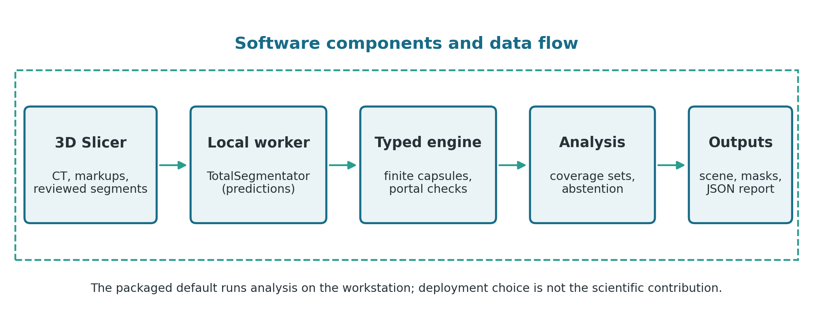
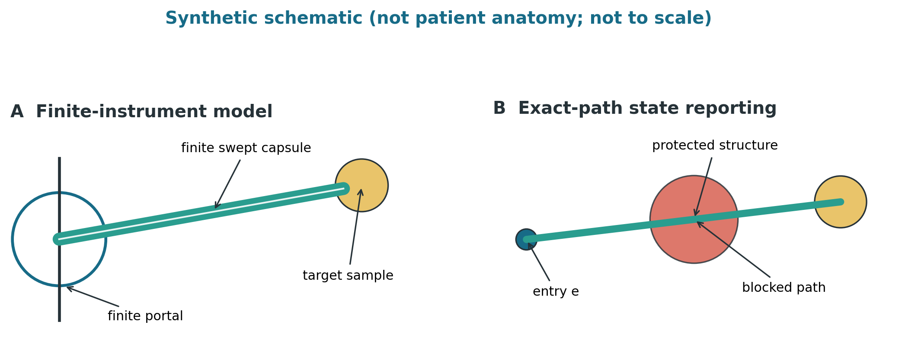
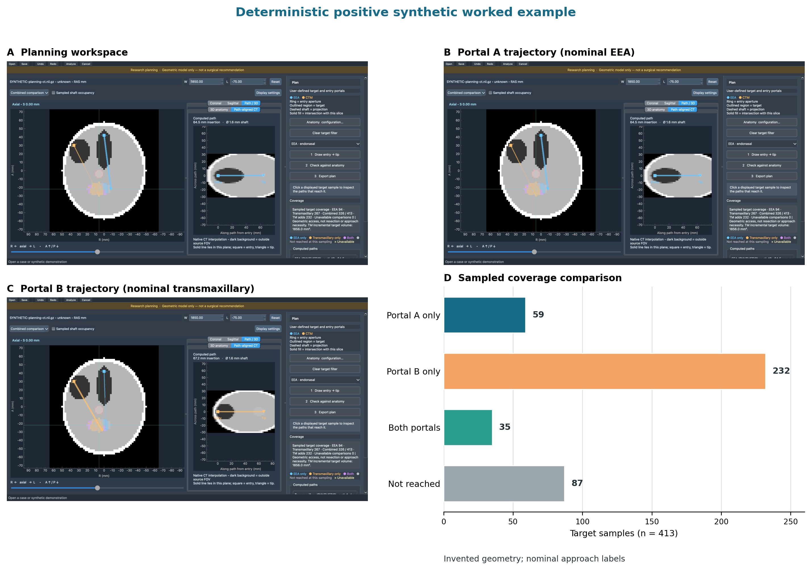

# CorridorKit: Open-source software for geometric comparison of skull-base surgical corridors

## Article metadata

- **Article type:** SoftwareX software article
- **Authors:** Abhinav Bachu\*, Raghav Rajesh, and Anand V. Germanwala
- **Affiliation:** Department of Neurological Surgery, Loyola University Chicago Stritch School of Medicine, Maywood, Illinois, USA
- **Corresponding author:** Abhinav Bachu (\*)
- **Corresponding-author email:** [abachu@luc.edu](mailto:abachu@luc.edu)
- **Software release cited by this article:** version 0.3.0
- **Repository URL:** https://github.com/abachu2005/corridorkit
- **Release tag:** `v0.3.0`
- **Release commit:** `db27dd0fc8c4a5517d9556269fdf7202e8659ec2`
- **Version DOI:** [10.5281/zenodo.23249277](https://doi.org/10.5281/zenodo.23249277)
- **Versioned software source:** [CorridorKit v0.3.0](https://github.com/abachu2005/corridorkit/tree/v0.3.0)

## Abstract

CorridorKit is open-source research software for analyzing rigid surgical access corridors in physical image coordinates. It models finite instruments, circular portals, target samples, and protected structures, retaining every evaluated trajectory with its insertion depth, clearance, and rejection or abstention reason. Missing anatomy is reported as unavailable rather than treated as free space, and approach coverage is compared with exact set operations. A typed Python engine supports command-line, desktop, and 3D Slicer interfaces. Skull-base surgery motivates the application; the numerical geometry is anatomy-agnostic. Verification combines analytical fixtures, cross-platform tests, native Slicer integration, and public-data replay.

## Keywords

research software; computational geometry; medical imaging; 3D Slicer; finite instruments; skull base; trajectory planning

## Code metadata (mandatory)

| Field | Value |
|---|---|
| C1 Current code version | `v0.3.0` |
| C2 Permanent link to code/repository used for this code version | Archived release: [10.5281/zenodo.23249277](https://doi.org/10.5281/zenodo.23249277); versioned source: [CorridorKit v0.3.0](https://github.com/abachu2005/corridorkit/tree/v0.3.0) |
| C3 Permanent link to Reproducible Capsule | N/A; no executable reproducible capsule has been deposited |
| C4 Legal Code License | Apache License 2.0 (`Apache-2.0`) |
| C5 Code versioning system used | Git |
| C6 Software code languages, tools, and services used | Python ≥3.11; 3D Slicer scripted module; Hatchling; GitHub; GitHub Actions |
| C7 Compilation requirements, operating environments, and dependencies | Python ≥3.11. CI covers Ubuntu, macOS, and Windows with Python 3.11 and 3.12. Core dependencies: NumPy, SciPy, nibabel, SimpleITK, pydicom, Pydantic, and Typer. Optional desktop dependencies: PySide6, pyqtgraph, and VTK. The scripted module requires 3D Slicer 5.12. |
| C8 Link to developer documentation/manual | [`README.md`](https://github.com/abachu2005/corridorkit/blob/v0.3.0/README.md), [`docs/USER_GUIDE.md`](https://github.com/abachu2005/corridorkit/blob/v0.3.0/docs/USER_GUIDE.md), and [`slicer/README.md`](https://github.com/abachu2005/corridorkit/blob/v0.3.0/slicer/README.md) |
| C9 Support email for questions | [abachu@luc.edu](mailto:abachu@luc.edu) |

Issues may additionally be reported through the
[GitHub issue tracker](https://github.com/abachu2005/corridorkit/issues).

## 1. Motivation and significance

Computational descriptions of a surgical corridor can obscure distinctions that materially change a geometric result. An infinitely thin ray is not a finite-width instrument; an instrument has finite length; an oblique instrument must fit through an aperture; an alternative route is not necessarily available simultaneously with another route; and an unrepresented structure is not demonstrated free space. A sampled failure to reach a target is also not proof of physical or operative inaccessibility.

CorridorKit makes these assumptions explicit and inspectable. Skull-base surgery is the motivating application, and the model-assisted adapter, entry proposals, approach labels, and public-data evaluation are cranial-specific. The numerical geometry engine contains no imaging thresholds or landmark logic: it operates on declared physical-space targets, portals, instruments, and protected geometry. Reuse in other rigid-access corridor studies requires replacing the approach labels and cranial adapters.

The intended users are technically supported surgeons and researchers. Existing image review functions are provided through 3D Slicer [@slicer]; the package adds finite insertion and aperture constraints, retained path witnesses, set-based approach comparisons, incomplete-anatomy abstention, and checksummed exports.

## 2. Related work

3D Slicer provides an extensible environment for segmentation, registration,
visualization, and image-guided-intervention research [@slicer; @ungi2016].
Procedure-specific modules have supported brain laser-ablation planning,
pedicle-screw trajectories, implant navigation, and stereoelectroencephalography
workflows [@yeniaras2014; @muralidharan2018; @chen2017; @narizzano2017]. These
systems integrate planning with image review but do not address
finite-instrument skull-base aperture geometry.

Computer-assisted neurosurgical trajectory planning has been studied for deep
brain stimulation, keyhole procedures, and intracranial electrodes
[@brunenberg2007; @beriault2012; @shamir2012; @trope2015; @sparks2017;
@wankhede2022]. The closest methods rank straight centerlines or cylindrical
safety envelopes according to distances from segmented hazards. Shamir et al.
map candidate cranial entries and placement uncertainty [@shamir2012], while
Bériault et al. use a cylindrical trajectory model [@beriault2012]. The
distinction here is the joint representation of finite
insertion length, shaft and tip radii, a constrained portal aperture, target
reach, exact retained witnesses, and alternative versus simultaneous coverage.

Quantitative skull-base anatomy commonly compares area of exposure, corridor
depth, angle of attack, surgical freedom, or working volume in cadaveric
specimens [@roth2009; @wilson2014; @elhadi2014; @lin2021; @agosti2022]. Those
measurements characterize named approaches and operative exposure rather than
a patient-specific feasible set of finite rigid-instrument poses against
represented anatomy. CorridorKit evaluates a declared geometric model
and does not infer operative exposure or maneuverability.

TotalSegmentator and its nnU-Net foundation can reduce the effort required to
construct image-derived models [@totalsegmentator; @nnunet], but general-purpose
labels do not supply all fine skull-base neurovascular boundaries. The software
therefore preserves missing structures as unavailable instead of interpreting
automated segmentation as complete anatomy.

## 3. Software architecture and functionality

### 3.1 Components and data flow

The `corridorkit` Python package separates domain models, image input/output, geometry primitives and engines, analysis, application services, desktop views, anatomy adapters, and exports. Typed Pydantic contracts define cases and results. The command-line interface supports synthetic-case generation, analysis, and environment reporting. The optional Qt/VTK desktop application provides linked anatomical slices, three-dimensional inspection, editable configuration, asynchronous analysis, and export.

The scripted Slicer module integrates CT selection, markups, segmentation review, candidate display, exact evaluated paths, linked two- and three-dimensional views, scene persistence, and report export. A separate bounded bridge can export selected Slicer segments on the full CT grid, convert Slicer's array order to engine order, retain the world-RAS affine, and import a saved coverage segmentation. Targets above the bridge's 2,000-foreground-voxel limit are rejected rather than silently subsampled.

The packaged Slicer workflow launches a managed TotalSegmentator [@totalsegmentator] process, using CPU or a compatible configured accelerator. Model predictions are labeled as predictions and require review. The geometry engine consumes reviewed image-derived structures independently of how those structures were produced.

A co-author (A.V.G.), a skull-base neurosurgeon, reviewed the software's
corridor model, research workflow, and interpretation of geometric results,
informing the methodology and presentation.

<div class="figure">

<p class="caption"><strong>Figure 1.</strong> Software architecture and data flow from image review through model-assisted segmentation, finite-instrument analysis, coverage comparison, and export.</p>
</div>

### 3.2 Coordinates and input representations

All engine geometry is represented in millimeters in a declared physical frame. Affine matrices map voxel indices to physical positions. Image loaders normalize declared RAS/LPS conventions and spatial units to RAS millimeters, and incompatible frames are rejected rather than silently aligned. Registration and resampling are explicit review operations.

Targets can be supplied as physical-coordinate points or mask-derived voxel centers. Complete voxel representations may carry physical cell weights computed from the affine determinant. Sparse samples support count-based coverage only and are not interpreted as tumor-volume percentages. Protected geometry can be represented by analytical spheres or affine voxel masks. Unsupported geometry, including the current unsupported mesh input route, causes abstention rather than being treated as empty space.

### 3.3 Finite-instrument reach and aperture model

For entry point \(\mathbf{e}\), unit direction \(\mathbf{d}\), and target sample \(\mathbf{x}\), required axial insertion is

\[
t=(\mathbf{x}-\mathbf{e})\cdot\mathbf{d},
\]

and perpendicular distance from the trajectory is

\[
\left\|(\mathbf{x}-\mathbf{e})-t\mathbf{d}\right\|.
\]

A target sample is a reach candidate only when insertion is nonnegative, does not exceed instrument length, and the perpendicular distance is no greater than the working-tip radius plus configured target tolerance. Shaft radius is not added to target tolerance.

The inserted instrument is modeled as a finite capsule from the entry point to the insertion depth required for the target. Collision and aperture checks conservatively use the larger of shaft radius and working-tip radius. A portal is a finite circular disk with a declared forward normal. The software checks forward traversal and conservatively tests whether the oblique shaft footprint fits the aperture.

<div class="figure">

<p class="caption"><strong>Figure 2.</strong> Synthetic finite-instrument geometry schematic. (A) A finite swept capsule traverses a finite portal toward a target sample. (B) Exact-path evaluation retains collision states against represented protected geometry. This schematic is not patient anatomy and is not to scale.</p>
</div>

Analytical sphere clearance is computed directly. Voxel masks represent closed affine cells. The coarse voxel backend uses conservative physical-space bounds and interpolation guards; optional near-boundary refinement checks candidate cells under a finite budget. Exhausting that budget preserves conservative blockage. Geometry required outside a protected mask field of view triggers the configured out-of-field policy.

### 3.4 Abstention, sampling, and comparison semantics

Missing, unknown, unsupported, or out-of-field protected anatomy can produce abstention. An explicit exploratory policy may permit a conditional result, but affected quantitative claims remain incomplete or suppressed. These policies do not detect every missing structure, segmentation error, incorrect portal, or unmodeled tissue.

The engine evaluates a configured angular grid and may add target-directed and budgeted adaptive directions. This search is finite and not exhaustive. Each evaluated trajectory retains its direction, target indices, insertion depths, clearance information, and rejection or abstention reason. Consequently, “not reached” means that no evaluated path reached the sample; it does not mean that no path exists.

Reached target-index sets are retained separately by approach. Union, intersection, and incremental coverage are computed as set operations to avoid double counting. Simultaneous-access analysis additionally enforces angular separation and finite capsule-to-capsule clearance. Alternative-path union coverage is not interpreted as simultaneous feasibility.

Supported unobstructed center-entry cases use geometry-aware interval-union integration for feasible solid angle. Protected-structure cases use spherical-cap grid quadrature with Voronoi area weights; added target-directed and adaptive witnesses receive no quadrature weight. Unsupported or nonconverged measurements are omitted.

## 4. Illustrative examples

### 4.1 Data-free synthetic workflow

A reader can generate and analyze a deterministic synthetic configuration:

```bash
python -m pip install -e '.[desktop,test]'
corridorkit synthetic case.json
corridorkit analyze case.json result.json
corridorkit doctor
```

The output records normalized configuration, software and schema versions, source and result checksums, evaluated trajectories, coverage sets, and abstention reasons. The bundled desktop demonstration can be opened without patient data or network access. Changing an analysis parameter invalidates the displayed result until analysis is rerun.

A researcher can perform a parameter sweep by manually editing the case JSON
and rerunning the analysis for each instrument diameter, instrument length,
portal size, or reviewed bone-removal configuration, then comparing the
reached-target sets and retained paths.

### 4.2 Reviewed segmented workflow in 3D Slicer

In the reviewed-segment workflow, a user loads a CT and aligned segmentations, identifies target and entry geometry, selects target and protected-anatomy segments, optionally supplies approach-specific bone-removal masks, configures portal and instrument dimensions, and runs the external geometry engine. The output segmentation categorizes target samples as approach-only, shared, sampled-unreached, or unavailable. These categories describe the evaluated configuration.

### 4.3 Model-assisted workflow

Slicer writes the selected CT to a private temporary workspace and starts the managed TotalSegmentator worker. The adapter maps available outputs to the CT grid, entry candidates are proposed, and exact finite paths are evaluated. The resulting state preserves `model_feasible`, `blocked`, `conditional`, `unavailable`, and `invalid` outcomes. `model_feasible` means that represented geometry did not block the configured finite instrument.

TotalSegmentator does not supply complete skull-base critical anatomy. Cranial nerves, cavernous-sinus contents, ophthalmic arteries, dura, and other structures can remain unavailable. The workflow displays these gaps as unavailable anatomy rather than treating them as free space.

## 5. Verification and worked example

Verification uses deterministic fixtures, independent geometric references,
cross-platform automated tests, and programmatic desktop interactions.
The CI matrix covers Ubuntu, macOS, and Windows with Python 3.11 and 3.12.
The native Slicer integration protocol exercises landmark invalidation, rotated
anisotropic KJI-to-IJK/RAS conversion, all five coverage categories, external
engine execution, the asynchronous analysis dialog, and scene-reference
save/reopen. The positive worked example was additionally verified
programmatically.

For the exact `v0.3.0` tag, all eight CI jobs passed. A clean detached
checkout passed 652 local tests; five public-cache tests were skipped because
their local data were absent. Wheel installation, packaged-extension checks,
native desktop interaction, and native Slicer 5.12.3 integration also passed.
The release-bound summary is tracked in
`docs/evidence/corridorkit-v0.3.0-verification.json`.

### 5.1 Positive worked example

The deterministic planning phantom contains an invented CT-like volume, a
413-sample ellipsoidal target, two finite portals, and three analytical protected
spheres. “EEA” and “transmaxillary” are nominal labels for synthetic Portal A
and Portal B, respectively. The same case
was analyzed through the desktop workflow used for image-linked review. Portal A
produced 27 feasible sampled trajectories reaching 94 target samples; Portal B
produced 77 trajectories reaching 267 samples. Set comparison assigned 59
samples to Portal A only, 232 to Portal B only, 35 to both, 87 to
sampled-unreached, and none to unavailable. The interface exposed 104 selectable
trajectory witnesses and invalidated them when configuration state changed.

<div class="figure">

<p class="caption"><strong>Figure 3.</strong> Positive synthetic worked example. (A) Linked-slice planning workspace. (B–C) Inspectable trajectories through Portal A (nominal EEA) and Portal B (nominal transmaxillary). (D) Sampled target-set comparison. Synthetic geometry and nominal approach labels demonstrate the software workflow.</p>
</div>

### 5.2 Numerical verification

For supported unobstructed analytical angular fixtures, an independent replay
recorded 82 of 82 comparisons below a prespecified one-percent relative-error
threshold; the maximum observed error was 0.0001204123%. This result applies to
the geometry-aware unobstructed method, not protected-structure quadrature. In a
separate grid-quadrature stress fixture, a small off-axis target retained
11.368% error at the finest grid. That is a resolution limitation of the
protected-geometry estimate: users should treat its solid-angle value as
descriptive, inspect convergence, and omit the measurement when convergence is
not demonstrated.

Voxel-cell refinement was first checked with 530 synthetic and 120 queries from
three public cases, then repeated under a frozen protocol for 4,720 queries
across 118 eligible NasalSeg cases (40 per case). A clearance-bound violation
means the reported positive clearance exceeded the independent cell-box
optimizer's upper distance bound after subtracting instrument radius. No
false-clear, clearance-bound, or field-of-view-policy violations were observed.
Refinement recovered 2,164 clear classifications that the coarse method
conservatively blocked. In 1,190 budget-exhausted queries, the specified
fallback preserved the coarse blocked classification; this was expected
fallback behavior, not evidence that refinement completed. Because the public
replay shares broad-phase candidate selection with the implementation, these
observations test bounded numerical consistency rather than completeness.

NasalSeg v2 [@nasalseg] supplied the public P001–P003 cases and the 118-case
replay cohort. Twelve of 130 image/label pairs were excluded because image and
label physical geometry did not match. Its air-space labels provide no
operative-corridor reference standard; the dataset is used only for file,
coordinate, and execution tests.

## 6. Impact

The software turns a reachability label into an inspectable record containing
the finite path, insertion depth, represented obstruction state, target subset,
and reason for rejection or abstention. It enables sensitivity studies of how
instrument dimensions, portal size, or reviewed bone removal change reachable
target fractions, and it supports in-silico pre-specification and replication
of exposure comparisons such as those in [@roth2009; @wilson2014; @elhadi2014;
@lin2021; @agosti2022] with explicit instrument assumptions. Slicer places the
records beside their source images and segmentations, reducing manual transfer
between image review and geometric analysis.

The release provides a shared, auditable foundation for phantom and cadaveric
study design, with reusable physical-space geometry algorithms. Adoption in
independent scholarly publications has not yet been documented.

## 7. Limitations

The model represents rigid instruments and omits tissue deformation, dissection planes, endoscopic optics, handle access, hemostasis, reconstruction, staged debulking, and other operative factors. It neither infers complete neurovascular anatomy nor measures safe resectability. Results depend on target and portal definitions, registration, segmentation quality, target sampling, finite direction sampling, instrument parameters, fields of view, and conservative voxel approximations.

The public dataset does not provide operative-corridor reference annotations.
TotalSegmentator predictions require review and do not represent all relevant
anatomy. Evaluation covers software and numerical verification, not clinical
validation: no cadaveric, tracked-instrument, operative-video, clinical-outcome,
or independent surgeon-usability study is reported. Non-cranial applications
have not been evaluated.

The model-assisted workflow depends on a large local machine-learning stack and
first-use model-weight retrieval. Installation time, disk use, and inference
latency vary substantially by platform and accelerator. The managed runtime
isolates these dependencies from Slicer's embedded Python, but does not remove
their upstream compatibility constraints.

## 8. Reproducibility and data availability

The source code is licensed under Apache-2.0. Dependencies retain their own
licenses. Version 0.3.0 is identified by Git tag
[`v0.3.0`](https://github.com/abachu2005/corridorkit/tree/v0.3.0)
at commit `db27dd0fc8c4a5517d9556269fdf7202e8659ec2`.
The archived release DOI is
[10.5281/zenodo.23249277](https://doi.org/10.5281/zenodo.23249277).
The distribution contains source, tests,
documentation, packaging scripts, and deterministic fixtures; it excludes
public CT archives, private data, model weights, and local sessions.

The source-release tooling uses an explicit allowlist, compares staged content
with current files, records hashes, and runs wheel smoke checks. The Slicer
package provisions an isolated per-user runtime without modifying Slicer's
embedded Python.

Synthetic fixtures and the worked-example generator are included in the
repository. NasalSeg v2 is third-party data available from
[Zenodo record 13893419](https://zenodo.org/records/13893419) under declared
CC BY 4.0 terms; it is not redistributed with the software. The retained
manifest records archive SHA-256
`60c6facf843685802c39e4adff4a05c081c1c4b6175c9cb573745c55abb0fa6a`.
Verification summaries and protocols are tracked in the public repository.
Full historical benchmark outputs and caches are retained in the local
development checkout and are not included in the archived software release.

## 9. Ethics and data governance

This work used only synthetic data and publicly available, deidentified data,
and did not involve human subjects research. It involved no recruitment,
private records, chart review, outcomes, or identity linkage.

Images, predictions, temporary work products, Slicer scenes, and reports remain
on the workstation unless the user explicitly exports them.

## 10. Conclusions

CorridorKit provides an open, inspectable implementation of
finite-instrument corridor analysis with explicit aperture constraints,
coverage sets, and unknown-anatomy states.
Its retained trajectories and coverage sets support reproducible comparison
of declared instrument and portal configurations.

### Future plans

Planned work includes supported mesh geometry, additional rigid and articulated
instrument models, and comparison with cadaveric exposure measurements and
independent user studies.

## 11. Author contributions

Abhinav Bachu: Conceptualization, Methodology, Software, Validation,
Investigation, Data curation, Visualization, Writing—original draft, and
Writing—review and editing.

Raghav Rajesh: Investigation, Visualization, Writing—original draft, and
Writing—review and editing.

Anand V. Germanwala: Methodology, Validation, Supervision, and Writing—review
and editing.

## 12. Funding

This research did not receive any specific grant from funding agencies in the
public, commercial, or not-for-profit sectors.

## 13. Declaration of competing interests

The authors declare that they have no known competing financial interests or
personal relationships that could have appeared to influence the work reported
in this paper.

## References

